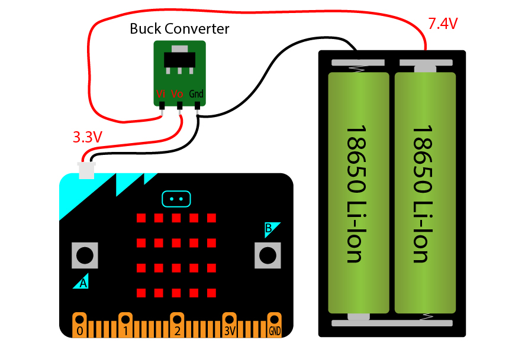
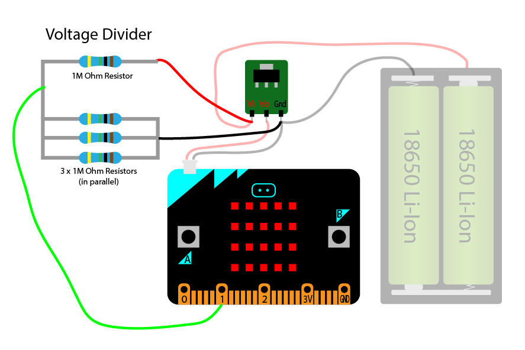
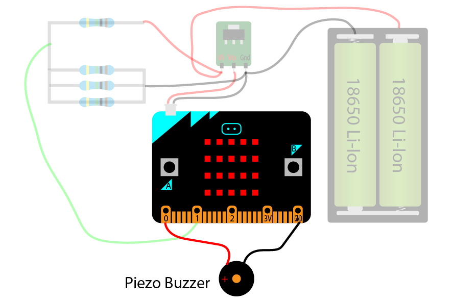

# micro:bit Pomodoro-Timer

The micro:bit Pomodoro-Timer is a timer that helps staying on track with work and study. It is based on the [Pomodoro Technique](https://francescocirillo.com/pages/pomodoro-technique) and it runs on a BBC [micro:bit](https://microbit.org) device. It's written in C++ using the [micro:bit runtime](https://lancaster-university.github.io/microbit-docs/) provided by Lancaster University. If you'd like to watch a demonstration and explanation of the project, [here's a link to it on YouTube](https://www.youtube.com).

## The Pomodoro Technique

The [Pomodoro Technique](https://francescocirillo.com/pages/pomodoro-technique) is an input based productivity and time management method. It was developed by Francesco Cirillio in the late 1980's. With this method, a given task is broken down into 25 min long chunks of work (called pomodoros). The timer the founder first used was a kitchen timer in the shape of a tomato, hence the name pomodoro (italian for tomato). After every 25 min of work (essentially when the timer goes off) you can take a 5 min break and then resume your work with another 25 min timer. After four pomodoros (4 x 25 min), you can take a long break of around 15 min and then start with the next cycle of another four pomodoros. During the 25 min of a pomodoro you must not engage in any other activities than working on the task that you set the timer for. The purpose of this method is to promote focus and flow and is especially suited to the current day and age where distractions abound. If you get distracted, the pomodoro is void and you have to start a new pomodoro. It's an input base productivity technique because you reach a daily goal not when a task is finished, but when you reach the number of pomodoros alloted for this task. In that sense, it shares similarities with the [timeboxing technique](https://en.wikipedia.org/wiki/Timeboxing), which Elon Musk is said to be using to organize his time.
#### The techinque in short:
1. Plan your tasks and estimate the number of pomodoros it will take
2. Set the timer for 25 min and work
3. Take breaks after each pomodoro (5 min for short breaks, and 15 min after 4 pomdoros)
4. Keep track of successful pomodoros
5. Review estimated number of pomodoros with actual pomodoros and adjust future task planning

## Motivation

I am a big fan of the pomodoro technique as it has helped me to stay focused on preplanned tasks. However I saw some room for improvement with the implementation of the technique, especially with the timer devices. There are essentially two different types of pomodoro timers: physical and software based pomodoro timers. The former often come in the form of kitchen timers. Physical timers can either be analog, with the user having manually to wind up the timer, or digital with a set of buttons and a screen. Here are two examples of physical timers:  

Software timers can be in the form of an App for your smartphone, a web application in your browser or a dedicated application on your Desktop.
In the next section I will discuss the advatages and disadvantages of each of these timers.

### Physical Timers vs Software Timers

Physical timers are easier and faster to handle than software based ones, making it more likely that a user will stick with the method. And because they are dedicated, single-purpose devices, they offer no distractions like a smartphone or computer would. Since promoting distranction free work is the main purpose of the method, this is a big advantage. However kitchen timers lack the logic component of software based pomodoro timers. They rely on the user to keep track of the number of pomodoros worked. And the timer duration has to be manually set every time. Next, most people already carry a smartphone with them, so using a physical timer would require bringing an additional device. Lastly, physical timers typically don't have a silent mode, which in some work enivromnets, such as libraries, can be impractical.
Software based Pomodoro Apps run on a device you already have with you and they keep track of your pomodoros for you. But they lack the simplicity and immediacy of physical timers and offer many distractions.

### The birth of the micro:bit Pomodoro-Timer

My aim with the micro:bit Pomodoro-Timer was to combine the advantages of physical and software based timers, while avoiding as many disadvantages as possible. The only drawback that was carried over from physical timers is the need to bring a separate device, which is partially mitigated by the small form factor of the BBC micro:bit.
The micro:bit Pomodoro-Timer is very straightforward to use: when it's powered up 1 button press is all that is required of the user. All the logic is handled by the device. Essentially it's the best of both worlds. And there's potential for further development, for example by connecting it to a smartphone over bluetooth to display statistics and modify settings. More on how the micro:bit Timer works in the [Usage](#usage) section below.

## Features

The current version is what I consider to be a MVP (minimal viable product). I plan on adding more [features](#future-development) in the near future.
These are the currently implemented features:
* Countdown timer of 25min, followed by a break timer
* Short breaks (5 min) and long breaks (25 min)
* The breaks start automatically after each pomodoro
* Long breaks after every 4th pomodoro
* LED matrix shows how much time remains in a countdown
* During breaks a random picture slowly emerges
* Buzzer sound at the end of pomodoros and breaks
* Battery checker (with the help of a voltage divider)
* Low battery warning sound

## Installation

Currently, to get the micro:bit Pomodoro-Timer working two steps are required:
1. A physical installation of the buzzer, buck converter and voltage divider.
2. Moving the hex file on to the pomodoro.

### Installing the hardware

I have added three hardware components to the micro:Bit in order to make it more useful as a pomodoro timer:
A [**buck converter**](https://www.amazon.com/dp/B01HXU1NQY/ref=cm_sw_em_r_mt_dp_Bp31FbEC262KV) to regulate the supply voltage down to 3.3V, a **voltage divider** (using 4x1M Ohm resistors) to measure the battery voltage and a **buzzer** for alerts (after a pomodoro or a break has finished). I chose to solder directly to the micro:bit for space saving reasons, as I will design a 3D printable enclosure for it. However, the are also breakout boards available for the micro:bit if you choose to go that route.

#### Adding a buck converter

I am using two 18650 Li-Ion batteries in series (2S). In this case the voltage ranges between 8.4V (when fully charged) and 6V (fully discharged). Using two 18650 batteries is a bit overkill, but it means I can use the micro:bit Pomodoro-Timer for a few weeks without having to charge it. The maximum voltage the micro:bit can be supplied with using the battery connector is 3.6V. Hence the need for a buck converter. The buck converter sits in between the battery and the micro:bit. The positive wire (red) from the battery goes to Vi (Volt input) of the buck converter. And Vo (Volt Output) goes to the positive side of the micro:bit. All Ground wires go to the same terminal on the voltage regulator.

#### Voltage divider

To get voltage sensing going we need to build a [voltage divider](https://en.wikipedia.org/wiki/Voltage_divider) with the help of a few resistors. A voltage divider is needed to reduce the voltage coming from the batteries, because the micro:bit cannot measure voltages higher than 3V. Our voltage divider bypasses the voltage regulator (buck converter). The voltage coming of the voltage divider will drop along with the voltage of the battery. That's in contrast to the voltage coming from the buck converter which should always stay at 3.3V no matter the actual voltage of the battery. Hence the need for a bypass to be able to measure the voltage of the battery. To reduce the current and battery consumption going through the divider, I chose a high resistance value (1 million Ohms) for our 4 resistors. The 3 resistors in parallel divide the resistance by three, effectively giving us an equivalent resistance of 333K Ohms. (If you have resistor of around 333K Ohms, you can use that instead of the 3 parallel resitors). Finally we need to connect a wire from Pin 1 of the micro:bit to the a spot between our first resistor and the 3 other resistors as shown in the diagram below. Make sure that the single 1M Ohms resistor goes to Vi and the 3x1M Ohms resistors are connected to Ground and not the other way around. There's a danger of frying the micro:bit if it's connected incorrectly. 

#### Adding a buzzer

There are two ways of connecting a [piezo buzzer](https://en.wikipedia.org/wiki/Piezoelectric_speaker) to the micro:bit: with or without a transistor. When using a transitor, the buzzer can be operated from the 3V pad of the micro:bit, thus making it louder. However here I will only show the easier method of adding a buzzer without a transitor. The buzzer has a negative and positive lead. Connect the positive lead with a wire to Pad 0 on the micro:bit and the negative lead goes to ground.

### Flashing the binary

Flashing the hex file is straightforward with the micro:bit. Just plug in the micro:bit to your computer (with a micro-USB cable) and it should appear as an external drive with the name 'MICROBIT'. Then drag the 'uBitPomoTimer.hex' file to that drive. They yellow LED next to the USB port should start flashing. When it has finished flashing, try pressing the A-button. A new pomodoro timer should start. That's all there is to it.

## Usage

When powered up, the A-button (the one on the left) of the micro:bit will start a pomodoro-timer that counts down from 25 min. It starts with all 25 LEDs lit up and each minute one LED dims down to 0 showing the user how many minutes are left. If the A-button is pressed while the timer is counting down, the pomodoro is cancelled and the device goes back to standby mode.
After a pomodoro has finished, a buzzer sounds and a break timer starts automatically. The break starts with all 25 LEDs turned off. Each minute, starting from the bottom of the LED matrix, a few LEDs start glowing to finally reveal one of a few pictures (changes randomly). Should you press the A-button during a break, a new pomodoro starts immediately. However if you let the break expire automatcally, a buzzer sounds again and the device goes back to standby mode. The timer duration is 5 min for the first three pomodoros and then 15 min after the forth pomodoro.
The device wakes up every few minutes to poll the battery voltage. If the voltage drops below 3.5V the buzzer goes of to indicate 'low battery'.

## Future Development

The table below lists all ideas I had for enhancements. I estimated the difficulty of each task given my skills. I will most likely work on easy features with a high priority first. 

|Features/ Changes                                       |Difficulty|Priority|Status|
|--------------------------------------------------------|----------|--------|------|
|Refactor code and use OOP to avoid global variables     |Medium    |High    |open  |
|Add different buzzer sounds for different functions     |Easy      |Medium  |open  |
|Show current battery voltage on button press            |Easy      |Medium  |open  |
|Show current ambient temperature when in standby mode   |Medium    |Low     |open  |
|Add the ability to pause and resume a pomodoro          |Medium    |Medium  |open  |
|Connect and sync with smartphone                        |High      |Low     |open  |
|Change Pomodoro- & Break duration on the micro:bit      |Medium    |High    |open  |
|Count and store daily pomodoros for statistics          |Medium    |Low     |open  |
|Design 3D printable enclosure                           |Easy      |High    |open  |
|Silent Mode with visual alarms                          |Easy      |High    |open  |
|Android and iOS companion App                           |Difficult |Low     |open  |
|Gameification and Challenges (badges, levels, unlocks)  |Difficult |Medium  |open  |
|Custom PCB with better microprocessor and display       |Difficult |Low     |open  |

